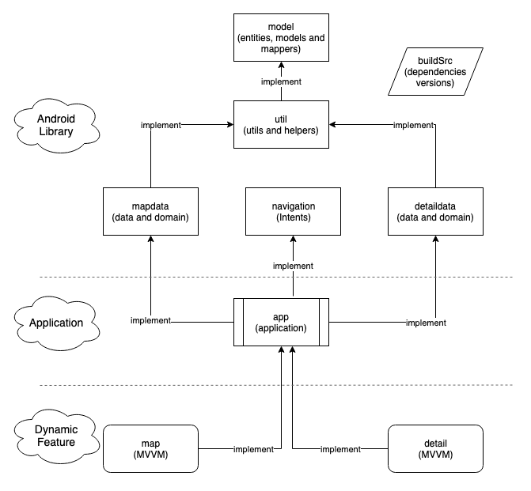
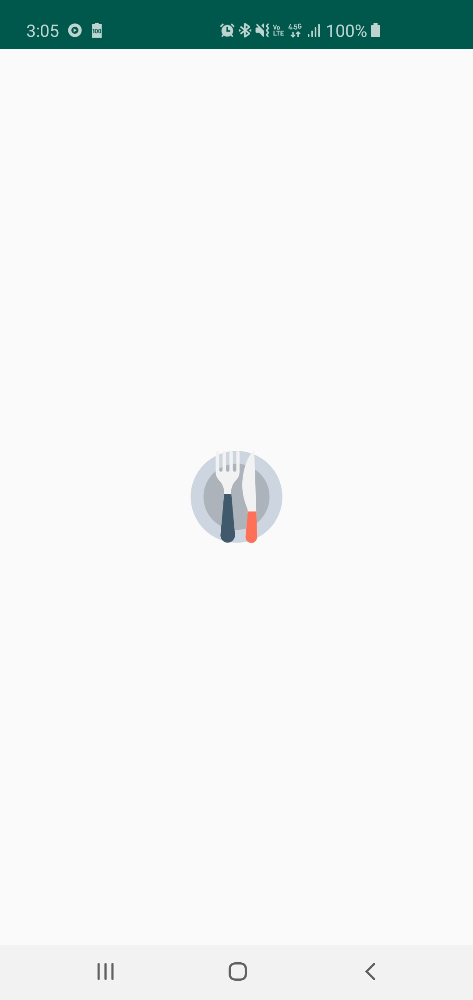
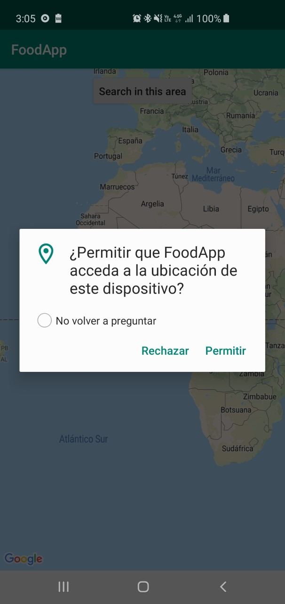
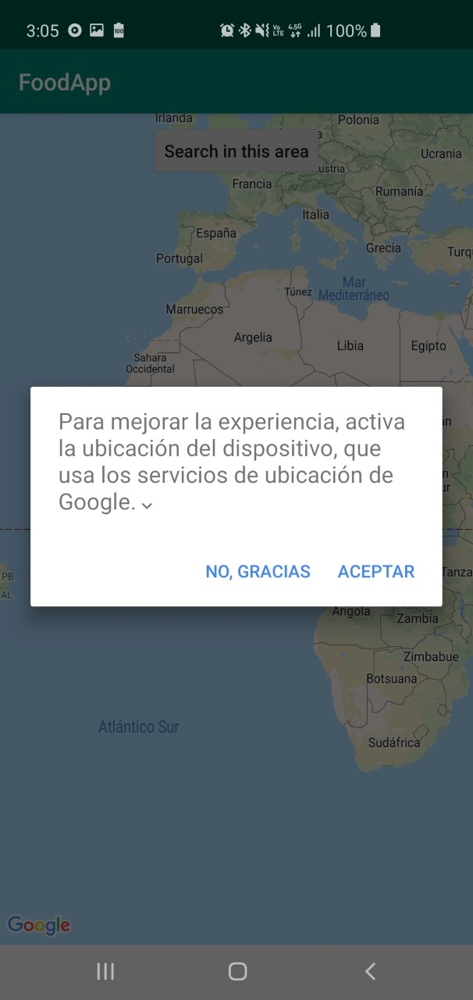
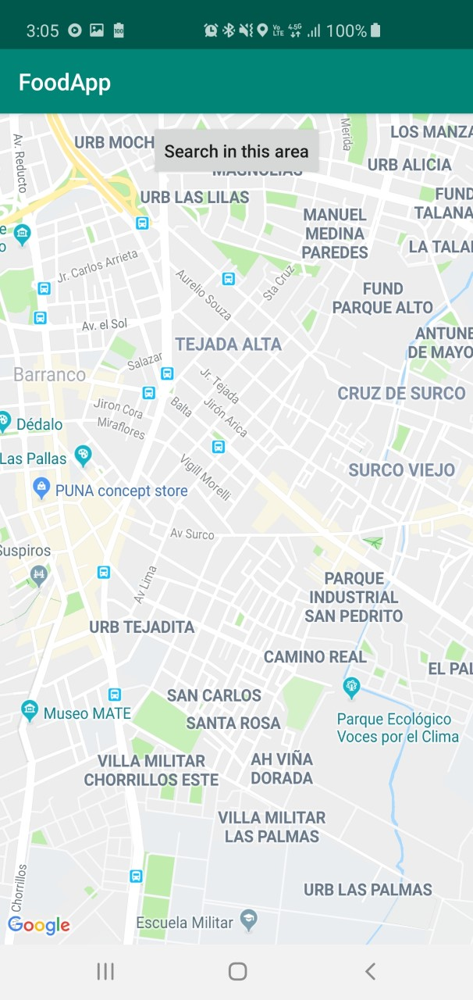
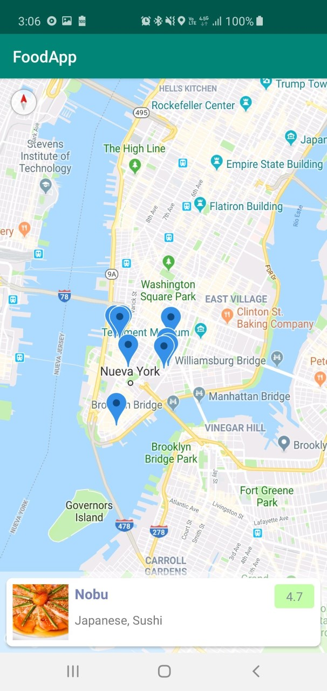
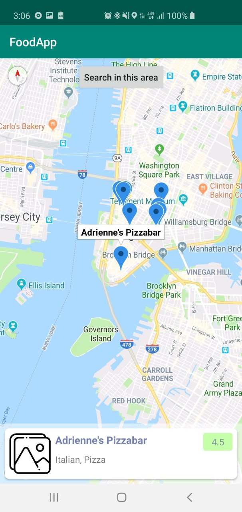
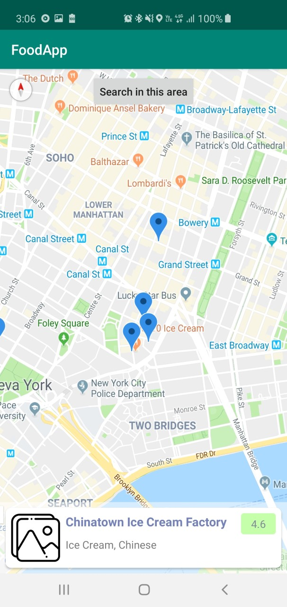
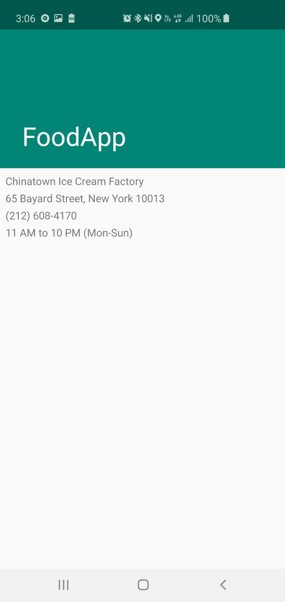
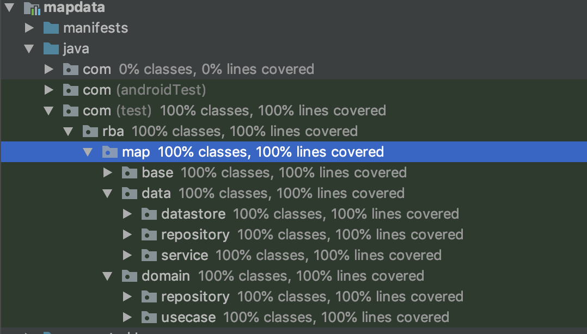

# ModularFoodApp

Proyecto de ejemplo utilizando **Kotlin**, **Android Libraries** y **Dinamyc Features**  

## Requerimientos

El proyecto funciona desde **Android 5+ (API 21+)** 

## Arquitectura

- Se está utilizando **Clean Architecture** y **MVVM** para la capa de presentación
- Se utilizaron: **Android Libraries**, **Application** y **Dynamic Feature**

## Uso 

- Splash  
    - Se encuentra en **app**
    - Abre la actividad **MapActivity** que se encuentra en el módulo **map**

  

- Permiso de GPS 
    - Se encuentra en **map**
    - Utiliza Google Maps
    - Solicita permiso de GPS
    - Solicita encender el GPS

    
     

- Mapa 
    - Se encuentra en **map**
    - Abre la actividad **DetailActivity** que se encuentra en el módulo **detail**
    - Utiliza Google Maps
    - Muestra un listado horizontal de los restuarantes que se encuentran cerca de la ubicación del usuario
    - En este caso, para **Perú** no hay información

   

- Moviendo el mapa hacia New York (si tiene data) 
    - Al mover el mapa, aparece un botón **Search in this area** para obtener las coordenadas del centro 
    de la pantalla y realizar una búsqueda, aunque sería mejor obtener las coordenadas de la parte 
    superior e inferior de la pantalla para realizar una búsqueda en toda el área y tener clusters 
    - Permite mover el mapa hacia una ubicación donde si existe data, por ejemplo: New York
    - Los resultados se muestran en la parte inferior del mapa
    - Los resultados tiene scroll horizontal

   

- Seleccionando un marcador 
    - Al seleccionar un marcador, aparece su nombre en la parte superior y en el resultado de la 
    parte inferior se muestra visible la información de dicha selección

   

- Buscando un restaurant en el listado 
    - Al hacer scroll en el listado, también se muestra en el centro de la pantalla el marcador

   

- Detalle **(in progress)**  
    - **Pantalla sin diseño** que muestra poca información del servicio

   

## Unit Test

Se hicieron tests para los módulos **mapdata** y **detaildata**, teniendo una cobertura de 100% en ambos módulos

   

## APK

Se encuentra [aquí](apk/)

     
     
*Happy coding!*